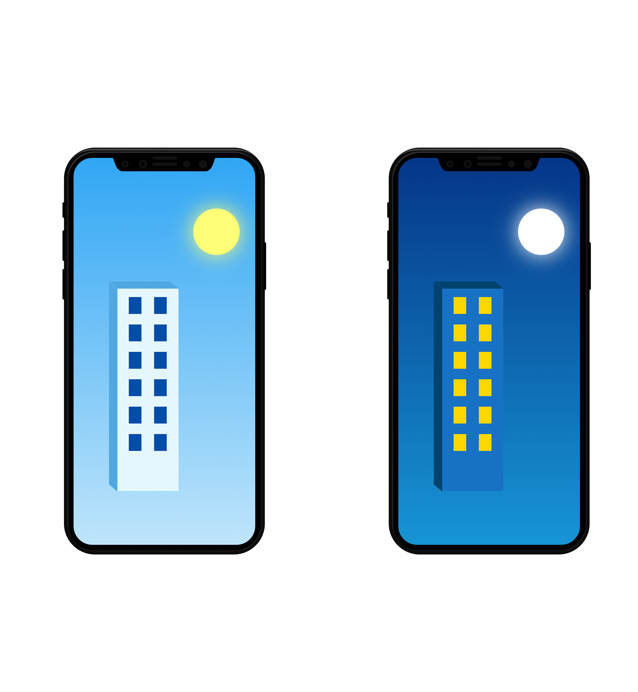

## 🚀 Desafio

Quremos ver como você se sai com HTML, CSS e JAVASCRIPT. Se você quiser usar Bootstrap ou jQuery não tem problema.
Acreditamos que você vai se sair muito bem então fique a vontade para nos surpreender.

Codifique o front-end do layout abaixo:

[Layout](http://ibacbrasil.com/testeWeb/layout.psd)

---

# 💻 Tecnologias

<a href='https://getbootstrap.com/'>Bootstrap</a>
 
<a href='https://jquery.com/'>Jquery</a>
 
<a href='https://popper.js.org/'>Popper.js</a>
 
<a href='https://sass-lang.com/'>Sass</a>

# 📝 Sobre o projeto

Este é um projeto para um processo seletivo. Seu principal objetivo é facilitar a avaliação dos recrutadores.

---

O aprendizado é contínuo e o próximo nível nunca será o último 🚀 by [aalvs](https://app.rocketseat.com.br/me/aalvs).
